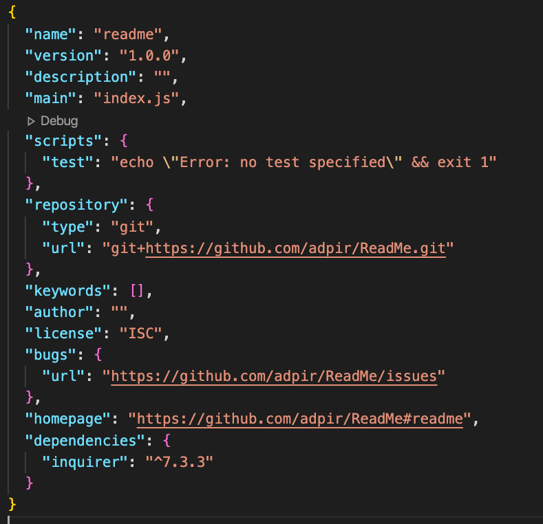

 read me
 

## Description : 

### Author : 

### Table of Contents 

* [Usage](#Usage)

* [Visuals](#Visuals)

* [Installation](#Installation)

* [Test](#Test)

* [Contact](#Contact)

 ### Usage:

 

### Visuals:
 
 
 
 

 
### Installation:

### Contributing:

### Test:

### :copyright: License

[MIT](https://github.com/adpir/README-Generator/blob/main/LICENSE)

### Contact:

If you have any questions please contact me at 

### :octocat: Profile:

[GitHub](https://github.com/adpir?tab=repositories)
    
    