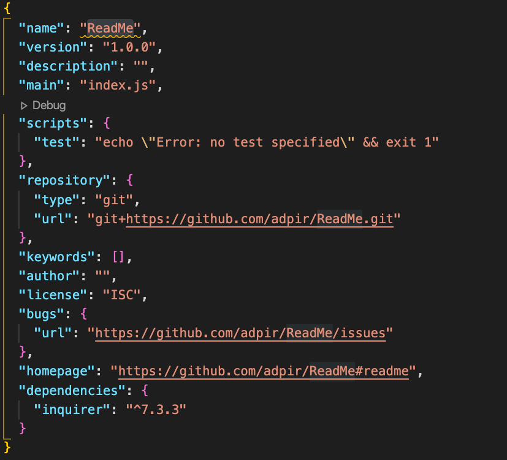

# Title : 


## Description : 
The goal of this project is to create a high quality **README Generator app**. On this professional **README**, the user will know how to *use* the app, *install it*, *report* any issues and *contribute*. My motivation for buiding this app was to create an app using new programming skills such as node.js, using an inline characters such as ```backtick```, functions, prompts and responses. 


### Author : Alice Piar


### Table of Contents 

* [Usage](#Usage)

* [Visuals](#Visuals)

* [Badges](#Badges)

* [Installation](#Installation)

* [Test](#Test)

* [Contact](#Contact)

* [Profile](#Profile)

 ### Usage:
 ```node index.js```


 ### :camera: Visuals:

 <br>
 <br>
 


 ### Badges
![Languages]<br>
 


### Installation:

To make a command-line application that dynamically generate a professional **README** file, the user need to install the ```npm``` know as (**Node Package Manager**) from the user's input using the ```inquirer package```. Here is some guidelines on how to create a README Generator: Create a ```.gitignore file``` and ```.DS_Store``` so that your ```node_modules``` directory isn't tracked or uploaded to GitHub. Rememeber to create a ```.gitignore file``` before installing any ```npm``` dependencies. Make sure that your repo includes a ```package.json```. Create one by running ```npm init``` when you first set up the project.  


### Contributing:

Yes! Pull request are welcome. For major changes please open an issue first to discuss what you would like to change. Please make sure to update test as appropriate.


### Test:

```npm install```


### License :copyright:


 


### Contact:

If you have any questions please contact me at adpir30@gmail.com


### :octocat: Profile:

[GitHub](https://github.com/adpir?tab=repositories)
    
    